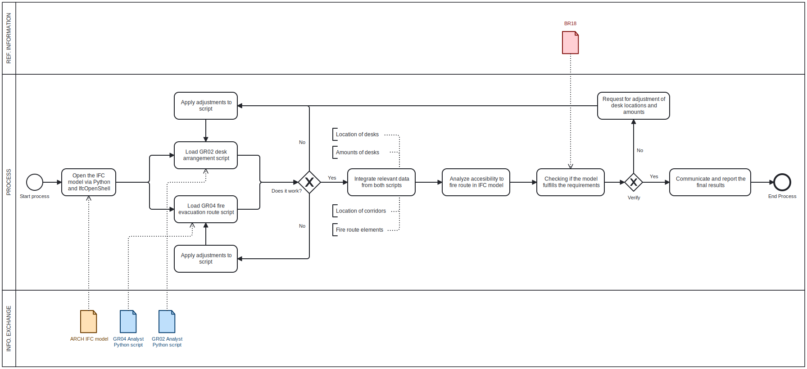

# A2 - Manager

---

## A2a

### 1. Python confidence
Group members: 
Nicolai, s225332 / Python Confidence score: 2 - Neutral

Total score of group: 2 - Neutral

### 2. Focus Area
Architecture / Fire evacuation analysis

---

## A2b

### 1. Building to focus on
Building #2516

### 2. Claim to check
Access to evacuation routes 

### 3. Short description of the claim
As manager, I integrate and analyze the results and claims from both analyst groups to evaluate how well the arrangement of desks ensures safe and compliant access to evacuation routes.

### 4. How it is justified
The claim is justified by BR18, which requires that evacuation routes must be accessible, unobstructed, and dimensioned according to the number of occupants in the building. The placement of desks must not block or extend the access paths to evacuation routes beyond the permitted distances and capacities. This ensures that all occupants at their desks have quick and safe access to escape routes in case of fire or emergency.

---

## A2c

### 1. How i would check the claim
I would check the claim by using IfcOpenShell and Python to load the IFC model and access relevant elements like desks, doors, and spaces. I would analyze the spatial relationships to ensure that desks do not block evacuation routes, verifying clearances and distances according to BR18. I would also perform collision checks to identify any obstructions and then output the results to confirm if the claim is valid or if adjustments are needed.

### 2. When the claim should be checked
This claim needs to be checked primarily during the design phase to ensure that the arrangement of desks complies with safety regulations before construction begins. It should also be verified during the building phase to confirm that the actual layout matches the approved design. Additionally, the claim may need to be reviewed during the operation phase whenever changes are made to the interior layout or occupancy to maintain safe evacuation access.

### 3. What the claim relies on
This claim relies on information about the building’s evacuation routes, including their location, dimensions, and accessibility. It also depends on the placement and size of desks and other furniture that might affect access. Additionally, it requires data on the number of occupants to ensure routes are sized correctly according to regulations like BR18. Finally, it depends on the building’s spatial and structural details from the IFC model to assess clearances and possible obstructions.

### 4. Bim purpose
The BIM purposes required for this claim are primarily gather, analyze, and communicate. Data must be gathered from the IFC model about desks, evacuation routes, and spaces. Then, analysis is needed to check compliance with safety requirements. Finally, the results must be communicated clearly to stakeholders for decision-making or adjustments.

### 5. Review of use case examples

No use case examples match my focus area exactly, but their structure helped clarify how to organize and link the steps in my BPMN diagram. I built on these examples to ensure a clear workflow, even though my use case is distinct.

### 6. BPMN-diagram
Check the link to the .svg file: https://github.com/NicolaiVoldstedlund/BIMmanager_g_01/blob/main/A2/IMG/GR01_A2.svg

---

## A2d
A new script is needed in the step where integrated data from the desk and fire route scripts is analyzed against the IFC model to check evacuation accessibility and compliance with BR18. This is highlighted in the BPMN diagram at "Analyze accessibility to fire route in IFC model" as the specific point for the new Python/IfcOpenShell tool/script.

---

## A2e

### 1 Tool Idea
The tool is a custom Python script using IfcOpenShell that automatically checks evacuation route accessibility and desk arrangements in IFC models against regulatory requirements from BR18. It integrates data from analyst scripts and validates whether layouts comply with fire safety rules, producing a clear compliance report for stakeholders.

### 2 Business and Societal Value
The business value lies in saving time and reducing manual errors, as building managers and consultants get fast, reliable feedback for design corrections. The societal value is increased safety and regulatory compliance in workplaces, as the tool ensures that evacuation routes remain unobstructed in real layouts. By using open standards, the solution is accessible for a wide range of projects, lowering barriers for safer building design.

### 3 BPMN Diagram

---

## A2f

---

## A2g

The software license for this project is: GPL-3.0